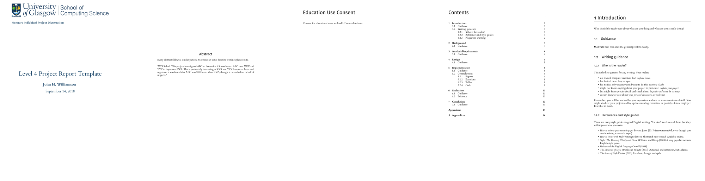

# UofG SoCS Level 4 Project LaTeX template

Provides `l4proj.cls`, the standard LaTeX template for Honours Individual Projects.

## Notes on formatting

The first page, abstract and table of contents are numbered using Roman numerals and are not
included in the page count. 

The first Chapter should start on page 1. You are allowed 40 pages for a 40 credit project and 20 pages for a 
20 credit report. This includes everything numbered in Arabic numerals (excluding front matter) up
to but excluding the appendices and bibliography.

**You must not alter font, text size (it is currently 10pt), margins or spacing.**

## LaTeX
This template has been tested with `pdflatex`. It should also work with `xelatex` and `lualatex`. Note that on Linux you may need to copy the contents of the `fonts/` folder to `~/.fonts/`.

